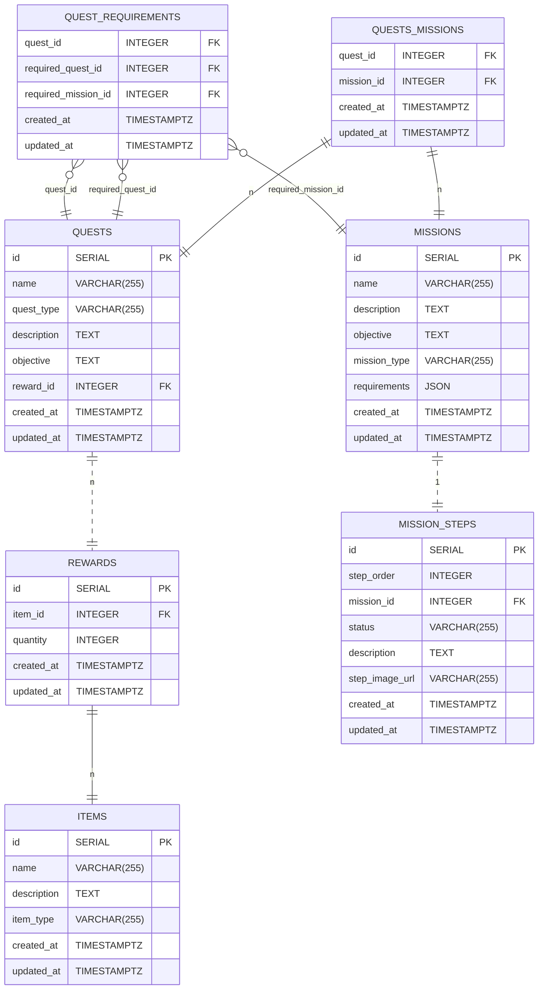

# ER

```mermaid
erDiagram
    QUESTS ||..|| REWARDS : "n"
    REWARDS ||--|| ITEMS : "n"
    QUEST_REQUIREMENTS }o--|| QUESTS : "quest_id"
    QUEST_REQUIREMENTS }o--|| QUESTS : "required_quest_id"
    QUEST_REQUIREMENTS }o--|| MISSIONS : "required_mission_id"
    QUESTS_MISSIONS ||--|| QUESTS : "n"
    QUESTS_MISSIONS ||--|| MISSIONS : "n"
    MISSIONS ||..|| MISSION_STEPS : "1"

    QUESTS {
        id SERIAL PK
        name VARCHAR(255)
        quest_type VARCHAR(255)
        description TEXT
        objective TEXT
        reward_id INTEGER FK
        created_at TIMESTAMPTZ
        updated_at TIMESTAMPTZ
    }

    REWARDS {
        id SERIAL PK
        item_id INTEGER FK
        quantity INTEGER
        created_at TIMESTAMPTZ
        updated_at TIMESTAMPTZ
    }

    ITEMS {
        id SERIAL PK
        name VARCHAR(255)
        description TEXT
        item_type VARCHAR(255)
        created_at TIMESTAMPTZ
        updated_at TIMESTAMPTZ
    }

    QUEST_REQUIREMENTS {
        quest_id INTEGER FK
        required_quest_id INTEGER FK
        required_mission_id INTEGER FK
        created_at TIMESTAMPTZ
        updated_at TIMESTAMPTZ
    }

    QUESTS_MISSIONS {
        quest_id INTEGER FK
        mission_id INTEGER FK
        created_at TIMESTAMPTZ
        updated_at TIMESTAMPTZ
    }

    MISSIONS {
        id SERIAL PK
        name VARCHAR(255)
        description TEXT
        objective TEXT
        mission_type VARCHAR(255)
        requirements JSON
        created_at TIMESTAMPTZ
        updated_at TIMESTAMPTZ
    }

    MISSION_STEPS {
        id SERIAL PK
        step_order INTEGER
        mission_id INTEGER FK
        status VARCHAR(255)
        description TEXT
        step_image_url VARCHAR(255)
        created_at TIMESTAMPTZ
        updated_at TIMESTAMPTZ
    }
```
